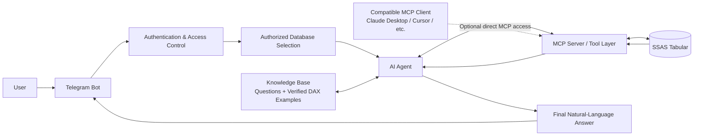

# SSAS AI Agent

An AI-powered, read-only analytics assistant for **Microsoft SQL Server Analysis Services (SSAS Tabular)**.

The project allows authorized users to ask business questions in natural language through Telegram. An AI agent analyzes the question, discovers the relevant SSAS model objects, generates safe DAX, executes it through an MCP server, and returns a human-readable answer based on live data.

The system is designed around three main principles:

- **Simple access** — users do not need to know DAX or the SSAS schema.
- **Controlled access** — each user can access only explicitly assigned databases.
- **Live, read-only answers** — the AI must query SSAS before returning a data-backed answer.

---

## Overview

A user can ask a question such as:

> What were the top 10 products by sales last month?

The system can then:

1. Verify the user's identity and database permissions.
2. Identify the selected SSAS database.
3. Search known DAX examples from the database-specific knowledge base.
4. Inspect tables, columns, measures, and relationships when necessary.
5. Generate an appropriate DAX query.
6. Validate the query as read-only.
7. Execute it against SSAS.
8. Return the live result to the AI.
9. Generate a natural-language answer for the user.

The AI is therefore used as an **agent and reasoning layer**, while SSAS remains the source of truth.

---

## Architecture



### Main Telegram path

```text
User
  ↓
Telegram Bot
  ↓
Email registration / authorization
  ↓
Allowed database selection
  ↓
Stateless AI Agent
  ↓
Knowledge Base + MCP Tools
  ↓
Read-only DAX
  ↓
SSAS
  ↓
Live Query Results
  ↓
AI-generated explanation
  ↓
Telegram User
```

The AI never chooses which database it wants to access.

The application selects an authorized database first and starts or reuses an **MCP subprocess scoped only to that SSAS server/catalog**.

This makes database authorization an application-level security boundary rather than just an instruction inside the AI prompt.

---

## Key Features

- Natural-language questions over SSAS data
- Telegram-based user interface
- Email-based user registration
- Per-user database permissions
- Support for multiple SSAS databases
- Global AI provider and model configuration
- Database-specific knowledge bases
- Recommended questions and date-period selection
- Free-text custom questions
- Live SSAS metadata discovery
- Automatic DAX generation
- Read-only DAX validation
- Mandatory live query execution before data-backed answers
- Query timeout and result limits
- Metadata caching
- Multiple MCP tools for model discovery and execution
- Stateless requests with no conversation memory between questions
- Concurrent usage across multiple Telegram users
- Terminal logging for monitoring AI, MCP, DAX, and execution flow
- Support for direct MCP connections from compatible AI clients
- Offline unit tests for core application logic

---

# How a Question Is Processed

Each user question is handled independently.

### 1. Authentication and authorization

The Telegram user is linked to an approved organizational email.

The application checks:

- whether the email is allowed;
- which database IDs are assigned to the user;
- whether the selected database is still permitted.

Only authorized databases are shown to that user.

---

### 2. Question analysis

The AI receives the current question together with the selected database context.

If similar verified questions exist in the knowledge base, relevant DAX examples can be provided as references.

Saved DAX examples are **not treated as live data**. They only help the AI understand the business model and known query patterns.

---

### 3. Model discovery

If the AI does not already have enough information to construct the query, it can use MCP tools to inspect the actual SSAS model.

For example, it may:

```text
search_model_objects("sales")
        ↓
list_measures("FactSales")
        ↓
describe_table("DimDate")
        ↓
run_dax(...)
```

This reduces the need for the model to guess table, column, relationship, or measure names.

---

### 4. DAX generation and validation

The AI generates a DAX query based on:

- the user's question;
- discovered model metadata;
- existing measures;
- relationships;
- relevant knowledge-base examples.

Before execution, the DAX is validated.

The execution layer rejects unsupported or unsafe query patterns such as write, processing, administrative, XMLA/TMSL, or direct DMV operations.

---

### 5. Live SSAS execution

Validated DAX is executed against the selected SSAS database.

Execution is bounded using controls such as:

- query timeout;
- maximum returned rows;
- maximum result size;
- maximum DAX size.

---

### 6. Automatic correction

If SSAS returns a DAX error, the error can be returned to the AI.

The AI can then analyze the error, modify the query, and try again within the configured agent step limit.

---

### 7. Final answer

A normal data-backed answer is accepted only after `run_dax` succeeds during the current request.

The final response is therefore based on live SSAS rows rather than values invented by the AI.

After the request is completed, the AI tool history is discarded.

---

# MCP Tools

The SSAS MCP server exposes a controlled set of read-only tools.

| Tool | Purpose |
|---|---|
| `health_check` | Verify SSAS connectivity and report the active database configuration |
| `list_tables` | List tables available in the semantic model |
| `describe_table` | Inspect a table's columns, measures, and relationships |
| `list_measures` | List available model measures |
| `search_model_objects` | Search tables, columns, and measures by business term |
| `list_relationships` | Inspect relationships between model tables |
| `get_model_schema` | Retrieve a bounded representation of the model schema |
| `refresh_metadata` | Reload metadata from SSAS and refresh the metadata cache |
| `preview_table` | Retrieve a small preview of a model table |
| `get_column_values` | Retrieve distinct values for a column |
| `run_dax` | Execute validated read-only DAX against SSAS |

The application also provides a local:

```text
search_knowledge_base
```

tool for retrieving relevant question/DAX examples from the selected database's knowledge base.

---

# Knowledge Base

Each database can contain its own set of known questions and verified DAX examples inside `databases.json`.

Example:

```json
{
  "label": "Most sold products",
  "question": "What are the most sold products?",
  "dax": "EVALUATE ...",
  "date_periods": [
    ...
  ]
}
```

These examples serve two purposes:

1. Provide recommended questions to Telegram users.
2. Give the AI high-quality references for understanding the organization's semantic model.

Knowledge is isolated by database. Examples belonging to one database are not exposed to an agent working on another database.

---

# User Access Control

Database access is configured in:

```text
allowed_emails.json
```

Example:

```json
{
  "users": [
    {
      "email": "employee.one@gmail.com",
      "databases": ["main"]
    },
    {
      "email": "employee.two@gmail.com",
      "databases": ["main", "finance"]
    }
  ]
}
```

Permissions are reread during authorization checks, so database access can be changed without restarting the bot.

Telegram ID ↔ email registrations are stored separately in SQLite:

```text
data/bot_auth.sqlite3
```

Database permissions are intentionally **not copied into SQLite**.

---

# Database Configuration

Databases are defined in:

```text
databases.json
```

A database configuration can contain:

- stable database ID;
- display name;
- SSAS server;
- SSAS catalog/database;
- enabled/disabled status;
- optional connection string environment variable;
- recommended questions;
- date-period options;
- verified DAX examples.

Environment variables can be referenced rather than storing connection information directly in JSON.

---

# AI Providers

The application uses one globally configured AI provider and model.

The model is **not selectable by individual users or databases**.

The current provider abstraction supports configurations for providers such as:

- DeepSeek
- OpenAI
- Gemini
- Qwen
- other compatible APIs through custom configuration

The selected model must support the tool/function-calling workflow required by the agent.

---

# Read-Only Security

The project is designed for analytical access only.

`run_dax` validates queries before sending them to SSAS and rejects unsupported or dangerous patterns.

Protections include checks against:

- write operations;
- processing operations;
- administrative commands;
- XMLA/TMSL-like payloads;
- direct `$SYSTEM` DMV queries through `run_dax`;
- statement chaining;
- excessive query size.

Query execution also has configurable timeout, row, and payload limits.

---

# Telegram Commands

Common bot commands include:

| Command | Description |
|---|---|
| `/start` | Register or begin database selection |
| `/selectdatabase` | Select or change the active database |
| `/questions` | Display recommended questions |
| `/reloadschema` | Reload SSAS metadata for the selected database |
| `/whoami` | Show the registered account and database access |
| `/cancel` | Cancel the current flow |
| `/help` | Display usage information |

---

# Compatible MCP Clients

Telegram is the primary organizational interface, but the MCP server can also be connected directly to compatible MCP clients.

Examples may include:

- Claude Desktop
- Cursor
- VS Code environments with MCP support
- other MCP-enabled AI clients

Conceptually:

```text
Compatible AI Client
        ↓
    MCP Server
        ↓
       SSAS
```

This is useful for developer, BI, or personal administrative workflows.

> [!WARNING]
> Direct MCP access bypasses the Telegram email/database authorization layer.

Usage limits in third-party AI clients also depend on the user's own plan and provider limits.

---

# Installation

## Requirements

The current SSAS integration uses ADOMD.NET / PyADOMD.

You will need:

- Python
- access to the target SSAS Tabular server;
- Microsoft Analysis Services ADOMD client libraries;
- a Telegram bot token;
- API credentials for the selected AI provider.

---

## 1. Create a virtual environment

From the project directory:

```powershell
python -m venv .venv
.venv\Scripts\activate
```

---

## 2. Install dependencies

```powershell
python -m pip install --upgrade pip
python -m pip install -r requirements.txt
```

---

## 3. Configure environment variables

Copy:

```powershell
copy .env.example .env
```

Then configure the required values in `.env`.

At minimum this includes:

- Telegram bot token;
- AI provider;
- AI API credentials;
- AI model;
- SSAS server/database settings;
- `ADOMD_PATH`.

---

## 4. Configure database permissions

Edit:

```text
allowed_emails.json
```

and assign database IDs to each approved email.

---

## 5. Configure databases and questions

Edit:

```text
databases.json
```

to configure:

- SSAS databases;
- display names;
- recommended questions;
- date periods;
- verified DAX examples.

---

## 6. Run the application

```powershell
python run.py
```

Alternatively, on Windows:

```text
start_bot.bat
```

---

# Account Administration

List registered Telegram/email bindings:

```powershell
python manage_accounts.py list
```

Reset an email registration:

```powershell
python manage_accounts.py reset employee@gmail.com
```

Changing a user's database permissions does not require resetting the account.

Edit `allowed_emails.json` instead.

---

# Concurrency

The Telegram application can process different users concurrently.

Updates belonging to the same Telegram user are serialized to prevent menu/session race conditions.

Each database has its own persistent MCP subprocess and SSAS worker.

Conceptually:

```text
User A ─┐
        ├─ Telegram Application
User B ─┘
             │
       ┌─────┴─────┐
       ▼           ▼
    MCP DB A     MCP DB B
       │           │
     SSAS A      SSAS B
```

This keeps database sessions isolated while allowing independent databases to operate concurrently.

---

# Project Structure

```text
.
├── app/
│   ├── agent.py
│   ├── agent_service.py
│   ├── ai_provider.py
│   ├── auth.py
│   ├── config.py
│   ├── knowledge.py
│   ├── mcp_host.py
│   │
│   ├── mcp_server/
│   │   ├── server.py
│   │   ├── client.py
│   │   ├── metadata.py
│   │   └── dax.py
│   │
│   └── telegram/
│       ├── bot.py
│       └── flow.py
│
├── data/
│   ├── bot_auth.sqlite3
│   └── cache/
│
├── tests/
├── allowed_emails.json
├── databases.json
├── .env.example
├── requirements.txt
├── manage_accounts.py
├── run.py
└── start_bot.bat
```

### Important modules

| File | Responsibility |
|---|---|
| `app/agent.py` | Stateless AI/tool-calling loop |
| `app/ai_provider.py` | Global AI provider/model abstraction |
| `app/auth.py` | Email registration and database authorization |
| `app/config.py` | Database configuration and target resolution |
| `app/knowledge.py` | Database-scoped knowledge-base search |
| `app/mcp_host.py` | Persistent database-scoped MCP processes |
| `app/mcp_server/server.py` | MCP tool definitions |
| `app/mcp_server/client.py` | SSAS/ADOMD execution |
| `app/mcp_server/metadata.py` | Schema discovery and metadata cache |
| `app/mcp_server/dax.py` | DAX safety validation |
| `app/telegram/bot.py` | Telegram startup and handlers |
| `app/telegram/flow.py` | User menus and question flow |

---

# Design Principles

This project intentionally keeps authorization, AI reasoning, and data access separated.

```text
Identity
   ↓
Application Authorization
   ↓
One Authorized Database
   ↓
Database-Scoped MCP Server
   ↓
Read-Only Tools
   ↓
SSAS
```

The AI is allowed to decide **how to investigate a question**, but it does not decide:

- who the user is;
- which databases the user can access;
- which database should be connected;
- whether write operations are allowed.

Those controls stay outside the model.

---

# Current Scope

The current version is focused on:

- SSAS Tabular;
- read-only analytics;
- Telegram as the primary organizational interface;
- one global AI provider/model;
- per-email database authorization;
- stateless question answering;
- local stdio MCP sessions.

The architecture leaves room for future additions such as:

- a web interface;
- centralized administration UI;
- richer audit logging;
- usage and cost dashboards;
- additional read-only MCP data sources;
- expanded automated integration testing.

---

## Summary

**SSAS AI Agent** provides a controlled bridge between natural-language questions and enterprise analytical data.

Instead of requiring every user to understand DAX and the underlying semantic model, the system combines:

**Telegram + Access Control + AI Agent + Knowledge Base + MCP + SSAS**

to turn a business question into a validated read-only query and return an understandable answer based on live data.

The result is a reusable architecture that keeps the user experience simple while keeping database access constrained and observable.